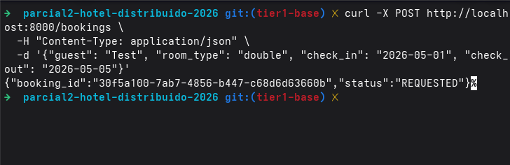
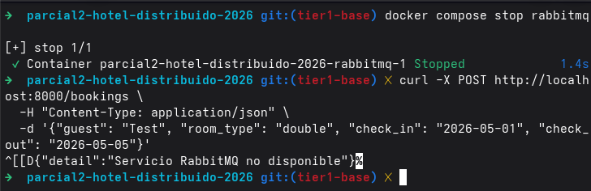
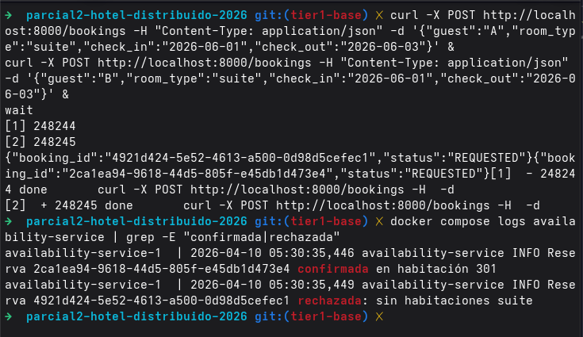

# Evidencia esperada

Suban aquí los siguientes archivos. Sin esta evidencia se pierden puntos de la sección de evidencia.

## Obligatorios

### 1. Capturas del Management UI de RabbitMQ
(`http://localhost:15672`, usuario: guest, password: guest)

- `rabbitmq-exchanges.png` — captura de la pestaña Exchanges mostrando el exchange `hotel`
- `rabbitmq-queues.png` — captura de la pestaña Queues mostrando las queues que su sistema creó (availability.requests, payment.requests, notifications)
- `rabbitmq-bindings.png` — captura de los bindings de la queue `notifications` (debe mostrar los dos routing keys: `payment.completed` y `payment.failed`)

### 2. Logs del flujo end-to-end exitoso
- `flujo-completo.log` — salida de `docker compose logs` filtrada al hacer un `POST /bookings` exitoso, mostrando los 4 servicios procesando en cadena

### 3. Ejemplo de curl
- `curl-ejemplos.md` — los comandos curl que usaron para probar, con sus respuestas


#### b5
`curl -X POST http://localhost:8000/bookings -H "Content-Type: application/json" -d '{"guest": "A", "room_type": "suite", "check_in": "2026-06-01", "check_out": "2026-06-03"}' & curl -X POST http://localhost:8000/bookings -H "Content-Type: application/json" -d '{"guest": "B", "room_type": "suite", "check_in": "2026-06-01", "check_out": "2026-06-03"}' & wait`
- 2026-04-09 22:44:11 2026-04-10 04:44:11,954 availability-service INFO availability-service esperando booking.requested...
- 2026-04-09 22:44:28 2026-04-10 04:44:28,687 availability-service INFO Recibido booking.requested: d1008eb5-f637-4b5d-b224-58f7c93810f3
- 2026-04-09 22:44:28 2026-04-10 04:44:28,693 availability-service INFO []
- 2026-04-09 22:44:28 2026-04-10 04:44:28,700 availability-service INFO Reserva d1008eb5-f637-4b5d-b224-58f7c93810f3 confirmada en habitación 301
- 2026-04-09 22:44:28 2026-04-10 04:44:28,700 availability-service INFO Publicado booking.confirmed para d1008eb5-f637-4b5d-b224-58f7c93810f3
- 2026-04-09 22:44:28 2026-04-10 04:44:28,701 availability-service INFO Recibido booking.requested: 61403c94-a712-410e-b94b-64cef030571b
- 2026-04-09 22:44:28 2026-04-10 04:44:28,703 availability-service INFO [<app.models.Booking object at 0x77392f923620>]
- 2026-04-09 22:44:28 2026-04-10 04:44:28,703 availability-service INFO Reserva 61403c94-a712-410e-b94b-64cef030571b rechazada: sin habitaciones suite
- 2026-04-09 22:44:28 2026-04-10 04:44:28,704 availability-service INFO Publicado booking.rejected para 61403c94-a712-410e-b94b-64cef030571b

## Opcionales (suman si están)

- `tests-output.txt` — salida de pytest si agregaron tests
- `concurrency-test.log` — evidencia de que arreglaron la race condition (B5): dos curl simultáneos y solo uno pasa
- `notas.md` — cualquier nota adicional sobre el proceso

## Cómo capturar logs

```bash
# Levanta todo
docker compose up --build -d

# En otra terminal, sigue los logs
docker compose logs -f > evidence/flujo-completo.log

# En otra más, dispara el flujo
curl -X POST http://localhost:8000/bookings \
  -H "Content-Type: application/json" \
  -d '{"guest": "Test", "room_type": "double", "check_in": "2026-05-01", "check_out": "2026-05-05"}'
```

# Ejemplos de curl

## 1. Reserva exitosa (flujo normal)



El booking-api recibio la solicitud, la publico en RabbitMQ y respondio 202. Luego availability-service confirmo la reserva, payment-service cobro (exitoso) y notification-service logueo el aviso. El flujo completo funciona.


## 2. Prueba de B2 (RabbitMQ caido)



## 4. Verificar B4 (overlap de fechas)


## 3. Prueba de idempotencia B7 (mensaje repetido)
# TODO


## 4. COnsultar estado de una reserva


## 5. Verificar B5 (race condition)
